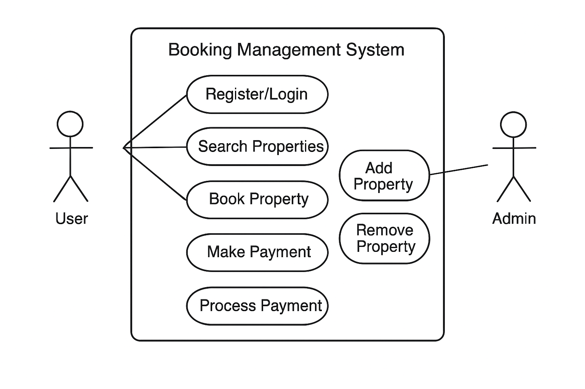

# Requirement Analysis in Software Development

## Introduction
This repository demonstrates the process of requirement analysis in software development. Requirement analysis is a critical phase that helps identify, document, and validate the needs and expectations of stakeholders for a software system. The purpose of this repository is to illustrate key concepts such as types of requirements, functional vs non-functional requirements, and acceptance criteria using a Booking Management System case study.

---

## What is Requirement Analysis?
Requirement Analysis is the process of identifying, gathering, and analyzing the needs and expectations of stakeholders for a software project. It acts as the foundation for the entire software development lifecycle (SDLC) because it determines what the system should do before design and implementation begin.

---

## Importance in SDLC
- **Clarity and Understanding:** Ensures that all stakeholders (clients, developers, and testers) have a shared understanding of the project requirements.  
- **Reduces Errors:** Early detection of incorrect, incomplete, or ambiguous requirements reduces costly errors later in development.  
- **Guides Development:** Provides a clear roadmap for design, coding, and testing phases.  
- **Improves Customer Satisfaction:** Meeting the actual needs of users leads to higher satisfaction and successful project delivery.  

---

## Why is Requirement Analysis Important?
Requirement Analysis is a critical phase in the SDLC because it lays the groundwork for the entire project. Here are three main reasons why it is essential:

1. **Prevents Scope Creep:**  
   Clear requirements help avoid unnecessary changes or additions during development, saving time and costs.

2. **Ensures Quality:**  
   Well-defined requirements provide a basis for testing and validation, resulting in higher quality software.

3. **Efficient Resource Allocation:**  
   Prioritizing requirements helps allocate development time and resources effectively.

---

## Key Activities in Requirement Analysis

Requirement Analysis involves several important activities that help ensure the software product meets user needs:

1. **Requirement Gathering**  
   - Collect information from stakeholders, customers, or users.  
   - Understand what the user expects from the system.  
   - Methods include interviews, surveys, questionnaires, and observation.  
   - *Example:* Asking a client what features they want in an online shopping app.

2. **Requirement Elicitation**  
   - Clarify and refine gathered requirements.  
   - Involves discussions, workshops, and brainstorming to uncover hidden needs.  
   - *Example:* Discovering during a workshop that users want an easy checkout process.

3. **Requirement Documentation**  
   - Write down all gathered and refined requirements clearly.  
   - Use Software Requirement Specification (SRS) documents to ensure consistency.  
   - *Example:* “The system shall allow users to reset their password via email.”

4. **Requirement Analysis and Modeling**  
   - Analyze requirements for completeness, feasibility, and consistency.  
   - Create models like flowcharts, use case diagrams, and data models.  
   - *Example:* Use case diagram showing how a user interacts with the shopping cart.

5. **Requirement Validation**  
   - Check requirements to ensure they meet user expectations.  
   - Stakeholders review and approve documented requirements.  
   - *Example:* Client reviews the SRS and confirms all necessary features are included.

---

## Types of Requirements

Requirements are generally classified into two types: **Functional** and **Non-functional**.

### Functional Requirements
- Define what the system **should do** – the features and functionalities.  
- **Examples for the Booking Management System**:
  - Users can register and log in to the system.
  - Users can search for available properties by date and location.
  - Users can book a property and make payments online.
  - Admin can add, edit, or remove property listings.

### Non-functional Requirements
- Define **how the system should perform** rather than what it does.  
- Include performance, security, usability, reliability, and scalability requirements.  
- **Examples for the Booking Management System**:
  - The system should load property search results within 2 seconds.
  - User data must be encrypted for security.
  - The system should support at least 1,000 concurrent users.
  - The application should be accessible on both desktop and mobile devices.

---

## Use Case Diagrams
Use Case Diagrams are visual representations that show how users (actors) interact with the system (use cases). They help in understanding the functional requirements, actors involved, and the overall system behavior.

**Benefits of Use Case Diagrams:**
- Provide a clear overview of system functionality.
- Help identify all user interactions and roles.
- Facilitate communication between stakeholders and developers.
- Serve as a basis for creating test cases.

- 

**Actors:**
- User
- Admin

- **Use Cases:**
- Register/Login
- Search Property
- Book Property
- Make Payment
- Add Property (Admin)
- Remove  Property (Admin)
## Acceptance Criteria

Acceptance Criteria (AC) define the specific conditions that a software feature must meet to be considered complete and acceptable by stakeholders. They are essential in Requirement Analysis because they:

- Ensure clarity: Clearly state what the feature should do and under what conditions it works.
- Facilitate testing: Provide a measurable standard for testers to verify the feature.
- Prevent misunderstandings: Align stakeholders, developers, and testers on expectations.
- Help prioritize: Allow teams to focus on what is most important for the user.

### Example: Checkout Feature in the Booking Management System

For a **Checkout** feature, the acceptance criteria could be:

1. **User Login:** Only registered users can access the checkout page.
2. **Cart Validation:** The system displays all selected bookings with correct details (property name, dates, and total price).
3. **Payment Processing:** Payment can be completed using credit card, debit card, or PayPal.
4. **Confirmation:** After successful payment, a confirmation message and receipt are displayed and emailed to the user.
5. **Error Handling:** Invalid payment details or failed transactions show clear error messages.
6. **Security:** All payment transactions are encrypted to protect user data.
7. **Performance:** Checkout process completes within 5 seconds for a standard booking.

